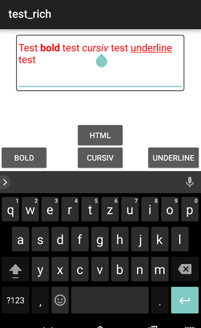

# Titanium Richtext Editor for Android

## work in progress

### Methods

* setHtml(String)
* getHtml()
* setBold()
* setCursiv()
* setUnderline()

### Library used:
* https://github.com/commonsguy/cwac-richedit
